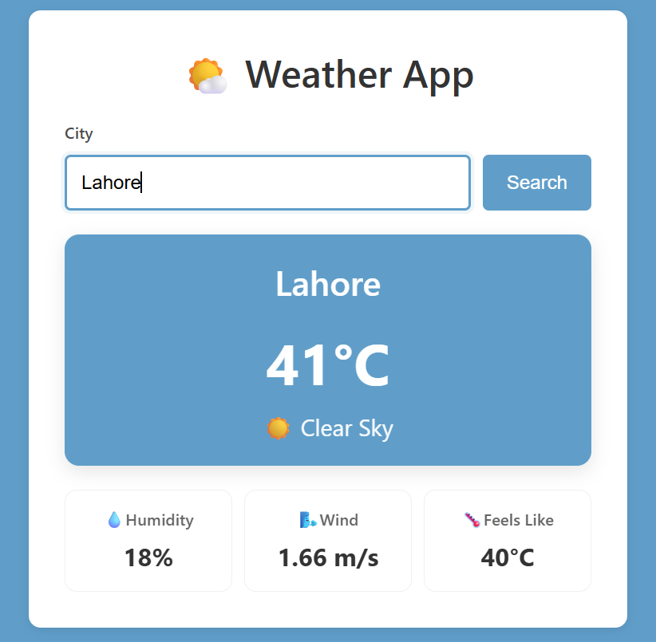

# Weather App

A simple, responsive weather application that fetches real-time weather data for any city using the OpenWeatherMap API. Built with Vanilla HTML, CSS, and JavaScript.

## Features

* Search weather for any city worldwide
* Display real-time temperature
* Show humidity information
* Display feels-like temperature
* Show wind speed
* Display weather description and icon
* Error handling for invalid city names
* Loading indicator during API requests
* Responsive design for mobile and desktop devices

## Tech Stack

* HTML5
* CSS3
* JavaScript (ES6+)
* OpenWeatherMap API
* Fetch API
* Async/Await

## How It Works

1. User enters a city name and submits the form.
2. The application sends a request to the OpenWeatherMap API using `fetch()` and `async/await`.
3. Weather data is returned in JSON format.
4. The application extracts and displays:

   * City Name
   * Temperature
   * Humidity
   * Feels-Like Temperature
   * Wind Speed
   * Weather Description
   * Weather Icon
5. Errors such as invalid city names or failed requests are handled gracefully.

## Setup and Run

### Clone the Repository

```bash
git clone https://github.com/Areej39/vanilla-js-weather-app
```

### Open the Project

Open `index.html` in your browser.

No build tools or additional installations are required.

### Configure API Key

Replace the API key in `script.js`:

```javascript
const API_KEY = "your_api_key_here";
```

You can get a free API key from OpenWeatherMap.

## Project Structure

```text
weather-app/
├── index.html
├── style.css
├── script.js
├── screenshot.png
└── README.md
```

## Learning Outcomes

This project demonstrates:

* Working with REST APIs using the Fetch API
* Handling asynchronous operations with `async/await`
* Using `try...catch...finally` for error handling
* DOM manipulation and event handling
* Form validation
* Managing loading states for improved user experience
* Parsing and using JSON data
* Building responsive user interfaces

Example API data usage:

```javascript
data.main.temp
data.main.humidity
data.main.feels_like
data.weather[0].description
data.weather[0].icon
data.wind.speed
```

## Demo


## Author

Made by **Areej Fatima** as a practice project for learning JavaScript, API integration, asynchronous programming, and responsive web development.
